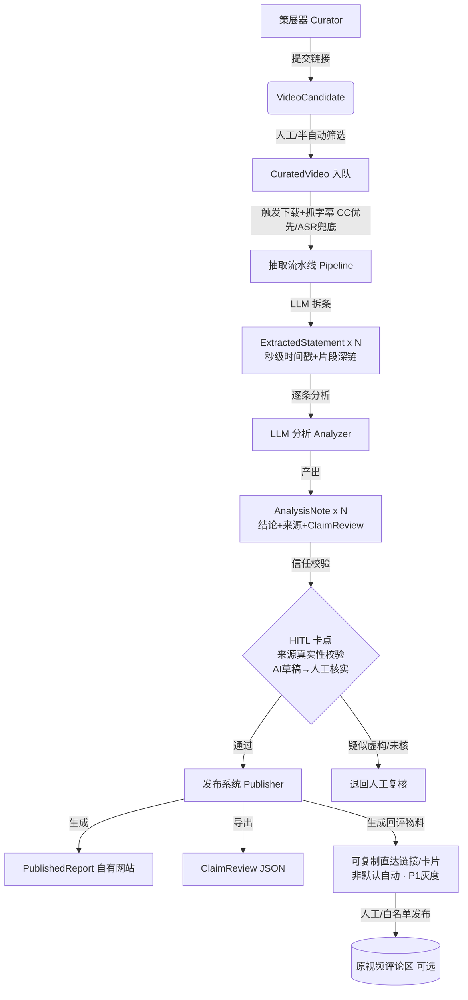

# FactEasy 事实核查平台 · 功能规格书（PRD）

| 项 | 内容 |
|---|---|
| **文档类型** | PRD（功能规格书） |
| **版本** | v1.1（Beta 立项稿 · 已回填路线图） |
| **日期** | 2026-08-15 |
| **编制** | 析客（Specky），需求分析师 · 产品战略团队；第 9 节时间线与行动清单由路径（Roadie），路线图规划师回填 |
| **参与成员** | 析客（需求分析师）、瑞思（用户研究员）、竞析（竞品分析师）、数析（市场/成本分析师）、路径（路线图规划师）、主理人（产品总监） |
| **状态** | 待评审（v1.1：第 9 节时间线 & 里程碑、✅ 行动清单已定稿，含 Gate 0–4 门禁与成本闸门） |
| **范围基线** | Beta 双平台（YouTube + Bilibili）；评论回填非默认全自动（P1 灰度）；信任三大底线；不做 deepfake 鉴定 |

---

## 📌 TL;DR（执行摘要）

1. **FactEasy 是一款把"视频里的某一句话"拆出来做事实核查、并可秒级回到原片复核、再把结论送回原视频场景的平台**——逐条 + 秒级锚点 + 回评的组合当前所有竞品均为空白（代差）。
2. **Beta 聚焦 4 大组件（策展器 / 抽取流水线 / LLM 分析 / 发布系统）的端到端闭环**，先做 YouTube + Bilibili 双平台、月处理 100–300 条，单条边际成本控制在 $0.15–$0.40。
3. **信任是生死线**：LLM 产出必须带"人类在环标识 + 来源真实性校验（防幻觉引用）+ 纠错通道"，并导出 schema.org ClaimReview，否则公信力不成立。
4. **评论回填不默认全自动**（合规雷区），Beta 改为"生成可复制直达链接/卡片 + 人工/白名单发布"，作 P1 灰度。
5. **不做 deepfake / 合成媒体真伪鉴定**，严格定位"对视频中可被语言表述的声称做事实核查"。
6. **路线图分三阶段、以门禁而非日历管理**：Phase 0 ≈ 8–10 周跑通 **YouTube 端到端 MVP-Live**（首批 20–30 条公开核查页，须过 8 项上线门禁）；Phase 1 ≈ 6–8 周补齐 B 站双平台 + 回评白名单灰度 + 可信度/权威源；Phase 2 ≈ 8–12 周扩短视频与长音频。全程设 HITL 硬卡点、合规前置卡点与成本闸门（单条 > $0.50 强制模型路由复核）。详见 §9。

---

## 🎯 核心结论卡片

| 维度 | 结论 |
|---|---|
| **推荐方案** | 双平台（YouTube + Bilibili）端到端闭环：策展 → 抽取（秒级锚点）→ LLM 分析（HITL）→ 发布（网站 + ClaimReview + 可复制回评链接）。评论回填默认人工引导，P1 灰度。 |
| **优先级** | P0：4 组件核心闭环 + 秒级锚点 + 信任三底线 + ClaimReview 导出。P1：多语种、B站评论回填、监测/预警、批量/API、创作者引用卡片。P2：TikTok/抖音、播客、画面核查。 |
| **预期影响** | 填补"视频逐条 + 秒级锚点 + 回评"三重市场断裂；单条核查成本 $0.15–$0.40、月 $30–$120（100–300 条）；建立"可复核、可溯源、可回现场"的公信力资产。 |
| **时间线** | **Phase 0 ≈ 8–10 周**（MVP-Live：YouTube 端到端闭环 + 首批 20–30 条核查页，首个可上线里程碑）→ **Phase 1 ≈ 6–8 周**（B 站双平台 + 回评白名单灰度 + 可信度/权威源）→ **Phase 2 ≈ 8–12 周**（TikTok/抖音、播客、视觉核查预研）。以相对周次 + Gate 0–4 门禁管理，不绑定日历月。详见 §9。 |
| **资源需求** | Phase 0：工程 2–3 人（1 流水线 + 1 全栈/前端 + 0.5–1 LLM 评估）、设计 0.5 人、运营质检 0.5 人（HITL）、法务 ≈5 人日；LLM/ASR 调用费 Beta 月 $30–$120。低于此配置则 Phase 0 顺延至 12–14 周，**优先保信任底线（M2），砍 P1 不砍 HITL**。 |
| **风险等级** | **中高**。主要风险集中在视频下载权/字幕可获取性、跨平台评论发布合规、LLM 幻觉引用反噬信任。均通过平台优先级、CC 字幕优先、**HITL 硬卡点（HITL-4/5）、合规前置卡点（COMP-1/2）、成本闸门（CG-1~CG-5）与阶段门禁（Gate 0–4）**缓解，见 §9.4/§9.5。 |

---

## ✅ 行动清单

> 排序即优先级：**1–12 为 Phase 0（P0，通往首个可上线里程碑）**，13–18 为 Phase 1（P1），19–21 为 Phase 2（P2），22 为全程持续项。时间窗为相对周次，详见 §9。**第 9 行（MVP-Live）是首个可上线里程碑，其余 P0 行动均服务于它。**

| # | 行动 | 负责方 | 时间窗 | 关联需求 |
|---|------|--------|--------|---------|
| 1 | 平台接口可行性验证：YouTube 字幕/下载稳定性（**必过**）+ B 站字幕语种覆盖（探路），产出 yt-dlp / 官方字幕 API 结论 | 技术负责人 + 数析 | P0 · W1–W2（**Gate 0**） | REQ-PIPE-01 |
| 2 | 法务合规前置评审：片段引用边界、跨平台评论/外链政策、免责与纠错口径，出**书面**意见 | 法务 + 主理人 | P0 · W1–W2（**Gate 0 · 阻断项**） | COMP-1/2, §8 |
| 3 | `ExtractedStatement` / `AnalysisNote` / `PublishedReport` Schema 定稿 + ClaimReview 映射评审并冻结 | 析客（定稿）+ 工程 | P0 · W1–W3 | REQ-DATA-01, REQ-PUB-02 |
| 4 | 策展器上线：双平台链接接入、按播放量/争议度排序、入选/驳回（含策展 SOP 与月度配额） | 工程 + 运营 | P0 · W2–W5 | REQ-CUR-01/02 |
| 5 | 抽取流水线：下载 + **CC 字幕优先 / ASR 兜底** + LLM 拆条（秒级时间戳与 `clipDeepLink`） | 工程（Pipeline） | P0 · W2–W5（**Gate 1**） | REQ-PIPE-01/02 |
| 6 | 编写 claim 抽取 + 逐条分析 prompt / rubric 与模型路由规则（4o-mini 首轮，存疑升级 4o），全线开启 prompt caching | 工程 + LLM 评估 + 数析 | P0 · W3–W6 | REQ-ANA-01, §5.3 |
| 7 | 设计并搭建 HITL 审核工作台：AI草稿 ↔ 人工核实、`reviewedBy` 署名、来源真实性校验、纠错工单与"有异议"标识 | 工程 + 设计 + 运营质检 | P0 · W4–W7（**Gate 2 硬卡点**） | REQ-ANA-02/03/04 |
| 8 | 发布站 + 方法论公开页 + 免责与 **Non-goal（不做 deepfake 鉴定）声明** + ClaimReview 导出 + 回评物料（`publishMode` 仅 `manual`） | 工程 + 前端 + 法务复核 | P0 · W6–W9（**Gate 2.5**） | REQ-PUB-01/02/03 |
| 9 | 🚩 **MVP-Live 上线**：YouTube 端到端闭环 + 首批 20–30 条公开核查页，须通过 §9.7 Gate 3 全部 8 项 | 全员（主理人签核） | **P0 · W8–W10（首个可上线里程碑）** | REQ-FLOW-01 + 全部 P0 |
| 10 | 建立人工抽检校准流程，输出质量基线（verdict 一致率、时间戳正确率）与模型路由阈值、单条审核 SLA | 运营质检 + 析客 | P0 · W8–W10，之后持续 | REQ-ANA-02, §10-3 |
| 11 | 成本看板与闸门上线：单条/月度成本可视化 + CG-1~CG-4 告警规则 | 工程 + 数析 | P0 · W7–W10 | §5.2/§5.3, §9.5 |
| 12 | 信任 A/B 实验："纯 AI 结论" vs "AI + 人工署名"的公众接受度基线 | 瑞思 + 运营 | P0 末 → P1 · W1–W3 | §3.3, §10-6 |
| 13 | Bilibili 深度接入（字幕获取、BV 深链、时间轴对齐），**完成 Beta 双平台范围基线** | 工程（Pipeline） | P1 · W1–W4 | REQ-PIPE-01 |
| 14 | 可信度评分 + 创作者可署名引用卡片导出（RICE 最高性价比，先做） | 工程 + 前端 | P1 · W1–W4 | REQ-ANA-06, REQ-PUB-07 |
| 15 | 权威源联动：Google Fact Check API + 中国互联网联合辟谣平台线索（**先做检索/引用，"提交"待法务放行**） | 工程 + 竞析 + 法务 | P1 · W3–W6 | REQ-PUB-05 |
| 16 | 评论回填灰度：白名单/授权账号发布，逐条人工确认 + 平台回执留痕；**任一平台拒绝或判 spam 即回退纯人工** | 运营 + 法务 + 工程 | P1 · W3–W6（COMP-2 就绪才启动） | REQ-PUB-04 |
| 17 | 多语种（≥中英）+ 热榜监测预警（**仅入候选池，不自动处理**）+ 批量/机构 API | 工程 + 运营 | P1 · W5–W8 | REQ-ANA-05, REQ-CUR-03, REQ-PUB-06 |
| 18 | Beta 复盘与 Phase 2 立项：用真实数据回填 §5.2 成本模型，输出回评"可行/回退"结论与扩量决策 | 主理人 + 数析 + 析客 | P1 末（**Gate 4**） | §5, §10 |
| 19 | TikTok / 抖音接入（人工策展 + 精选高影响力片段起步，**不做全自动抓取**），扩量前过 CG-5 | 工程 + 运营 | P2 · W1–W6 | REQ-PIPE-03 |
| 20 | 播客 / 长音频核查（时长上限 + 队列配额，防成本失控） | 工程 | P2 · W3–W8 | REQ-PIPE-04 |
| 21 | 画面/视觉主张核查**预研**（OCR 可行性 + 边界声明，不承诺交付）+ 截图/描述检索与人工上报通道 | 技术预研 + 析客 | P2 · W5–W12 | REQ-ANA-07/08 |
| 22 | 持续运营：HITL 抽检校准、纠错工单复审 SLA、月度成本与质量复盘、平台政策变更监控 | 运营质检 + 数析 + 法务 | 全程（P0 起） | REQ-ANA-02/04, §9.4/§9.5 |

---

## ⚠️ 待确认 / 假设 / Non-goals

- **待确认**：各平台评论/外链最新政策与白名单申请路径；LLM 厂商当月牌价；B站字幕语种覆盖；多语种优先级排序。
- **关键假设**：Beta 单视频 ~20 分钟、~25 条 claim、CC 字幕优先可跳过 ASR；普通公众对"AI+人工署名"核查的接受度（待信任实验验证）。
- **Non-goals（Beta 明确不做）**：deepfake / 合成媒体真伪鉴定；全平台全自动抓取；自建海量核查数据库；默认全自动评论回填；TikTok/抖音/Podcast 全流程（Phase 2）。

---

## 一、产品目标（3 个清晰、正交的目标）

> 三个目标彼此正交：① 解决"拆得准"，② 解决"信得过"，③ 解决"送得到"。互不重叠，共同支撑核心价值主张。

**目标 G1 — 精准拆解（Granularity）**
> 对任意入选视频，自动将其拆解为一条条可定位的陈述/论点/声称事实，**每条绑定秒级时间戳与可播放片段链接**，让用户"回到原片某一秒自己看"。

**目标 G2 — 可信可溯（Trustworthy）**
> 每条分析结论附带结构化判定（真/假/误导/部分真/无法判定 + 置信度）、透明来源与参考资料，且经**人类在环审核标识**与**来源真实性校验**，输出可被搜索引擎与第三方识别的 ClaimReview。

**目标 G3 — 场景回流（Reachable）**
> 核查结果不仅沉淀在自有网站，还能以**可复制的直达链接/核查卡片**形式回流到用户正在消费的原视频场景（评论区/群聊/报道），缩短"核查→触达"的速度差。

---

## 二、用户故事（4 个场景）

**US-1｜普通公众·即时查证（画像①）**
> 作为刷到"XX 食物致癌"视频的公众，我粘贴视频链接并提交核查，几分钟后得到逐条"真/假/存疑"结论；我点击某条结论的片段链接，**直接跳到原视频 02:13 那一句话**自己确认，然后把结论分享到家族群。
> *Acceptance*：Given 我提交一个 YouTube/B站 链接，When 流水线处理完成，Then 我能在结果页看到 ≥1 条带秒级片段链接的核查，并一键复制分享。

**US-2｜内容创作者·引用前自查（画像②）**
> 作为科普 UP主，我做"辟谣"视频前，先把参考视频提交核查，拿到带时间戳的"声称事实"清单与可署名引用卡片，避免翻车。
> *Acceptance*：Given 我提交一条含争议观点的视频，When 分析完成，Then 我能导出带原始时间戳与来源链接的引用卡片（P1）。

**US-3｜媒体记者·突发可审计核查（画像③）**
> 作为突发新闻记者，我用 FactEasy 快速验证一条社媒流传视频中的关键声称，拿到**可审计证据链 + ClaimReview 结构化结论**，嵌入报道。
> *Acceptance*：Given 记者请求某 claim 的证据链，When 发布完成，Then 系统导出符合 schema.org ClaimReview 的 JSON，且每条含 reviewedBy 署名与来源 URL。

**US-4｜平台/机构·批量标准化（画像④）**
> 作为平台 Trust & Safety 团队，我批量提交举报视频，系统按优先级产出标准化核查页 + ClaimReview，并可经白名单把直达链接回流到原视频评论区。
> *Acceptance*：Given 我批量提交 N 条视频，When 全部进入队列，Then 可按"争议度/播放量"排序，且每条产出可被 API 消费的 ClaimReview（P1/P2）。

---

## 三、用户研究洞察（来自瑞思，提炼要点）

**3.1 四类核心用户（价值链：生产—核查—传播—治理）**
| 用户 | 关系 FactEasy | 首要未满足需求 |
|---|---|---|
| ① 普通公众 | 结果消费者 + 传播节点 | 快 + 看得懂 + 能转发 |
| ② 内容创作者 | 上游素材供给 + 二次传播 | 批量/API + 可署名引用卡片 + 秒级可剪辑片段 |
| ③ 媒体记者/编辑 | 专业核查需求方 + 背书来源 | 实时 + 可审计证据链 + 符合出版标准的 ClaimReview |
| ④ 平台/机构 | B 端/机构客户 | 批量 + 标准化输出 + 与现有工作流集成 |

**3.2 信任机制诉求（信任是第一性原理，对标 IFCN 五支柱）**
> 必须实现的信任信号（按重要性）：① 可复核片段（秒级时间戳+片段链接，最强锚）；② 来源透明（防 LLM 幻觉引用）；③ 方法论公开；④ **人类在环（AI草稿 vs 人工核实，关键设计）**；⑤ ClaimReview 标准；⑥ 置信度/不确定性标注；⑦ 中立呈现（真相三明治）。

**3.3 三大关键风险（必须写进 PRD）**
- **LLM 幻觉引用**：编造不存在的来源链接会反噬信誉 → 必须做"来源真实性校验"（链接可达 + 内容匹配）或强制 HITL。
- **过度承诺**：声称可鉴别 deepfake 易被证伪 → Beta 严格限于"声称事实核查"，画面鉴定作边界声明。
- **责任归属**：AI 结论出错责任在平台 → 需"免责声明 + 人类核实标识 + 纠错通道"。

**3.4 用户侧 P0 功能基线（供需求池对齐）**
> 视频链接→自动拆条+秒级锚点；清晰结论+置信度+来源；可复核片段+来源透明+方法论页；ClaimReview 输出；发布到网站 + 原视频评论区贴直达链接；**HITL 标识 + 来源校验 + 纠错通道（信任底线）**。
> Beta 明确不做：deepfake / 合成媒体真伪鉴定。

---

## 四、竞品对比（来自竞析，功能矩阵）

**4.1 选取 7 个代表对象/标准**
Google Fact Check Explorer+ClaimReview、Full Fact AI、Logically、腾讯较真AI、GetFact(Laura)、X/YouTube Notes、文章级（Snopes 等）。

**4.2 功能对比矩阵**

| 功能维度 | FactEasy（目标） | Full Fact AI | Logically | 腾讯较真AI | GetFact | X/YT Notes | 文章级 |
|---|---|---|---|---|---|---|---|
| 1. 多平台策展/接入 | ✅ | ⚠️ | ✅ | ❌ | ❌ | ✅原生 | ❌ |
| 2. 自动下载+转写(ASR) | ✅ | ✅ | ✅ | ❌ | ⚠️ | ❌ | ❌ |
| 3. 逐条内容抽取 | ✅ | ✅ | ✅ | ⚠️ | ✅ | ❌ | ⚠️ |
| 4. **秒级时间戳+片段链接** | ✅**核心** | ❌ | ❌ | ❌ | ❌ | ❌ | ❌ |
| 5. LLM 分析笔记 | ✅ | ⚠️ | ⚠️ | ✅ | ✅ | ⚠️ | ✅ |
| 6. ClaimReview/API | ⚠️目标支持 | ✅ | ⚠️ | ❌ | ❌ | ✅ | ✅ |
| 7. 多语种 | ⚠️≥中英 | ✅ | ✅ | ⚠️ | ⚠️ | ✅ | ⚠️ |
| 8. 发布自有网站 | ✅ | ⚠️ | ⚠️ | ✅ | ✅ | ✅ | ✅ |
| 9. **回填原视频评论区** | ✅**核心** | ❌ | ❌ | ❌ | ❌ | ❌ | ❌ |
| 10. 平台辟谣标签联动 | ⚠️可选 | ❌ | ⚠️ | ⚠️ | ❌ | ✅ | ⚠️ |

**4.3 核心结论**
> 第 4 行（秒级锚点）与第 9 行（回填评论）**所有现成竞品均为 ❌**，是 FactEasy 的代差。没有一家把"视频逐条 + 秒级锚点 + 回评"串成闭环。最大风险集中在"视频下载权"与"跨平台评论发布"——故 Beta 评论回填**不宜默认全自动**，改为"生成可复制直达链接/卡片，引导人工发布"。

---

## 五、数据依据（来自数析，成本 / 市场要点）

**5.1 市场窗口**
- 全球专业核查机构数已 plateau（2022 峰值 453 → 2024 439 → 2025 443），而公众担忧"真假难辨"持续走高（Reuters DNR 59%→58%）。**供给停滞、需求上升 = 窗口期。**
- 视频是 misinformation 主战场：TikTok MAU 17.4 亿、抖音 DAU 7–8 亿（日上传 2000–3000 万条）；27% TikTok 用户最难辨真假（全平台最高）；热点视频约 1/5 含误导信息。
- 传播速度（小时级）远快于核查响应（天级）→ FactEasy "秒级锚点 + 回评"正是为填这道时间差。

**5.2 Beta 成本（边际处理费，不含人力/基建）**
| 方案 | 单条成本 | 月 100 条 | 月 1000 条 |
|---|---|---|---|
| 极简自托管 | ~$0.04 | ~$4 | ~$40 |
| 经济型(4o-mini+Whisper) | ~$0.15 | ~$15 | ~$150 |
| 推荐型(4o+缓存) | ~$0.32 | ~$32 | ~$320 |
| 旗舰型(Sonnet) | ~$0.50 | ~$50 | ~$500 |

> **单条区间 $0.04–$0.50；Beta 落点 $0.15–$0.40；建议月度处理费 $30–$120（100–300 条）。**

**5.3 最大成本杠杆（决定 Beta 经济性）**
1. **复用平台字幕（CC）跳过 ASR**：省 ~$0.12/条（占 API 方案 30–80%）。
2. **模型路由**：4o-mini 首轮抽取+初判，存疑升级 4o/Sonnet，省 60–80%。
3. 提示词缓存（输入 5 折）、存储精简、幂等复用。

**5.4 平台优先级（数据化建议）**
- **P0：YouTube**（27 亿 MAU、工具成熟、自带字幕、中长内容易拆条）。
- **P1：Bilibili**（3.4 亿 MAU、字幕生态好、覆盖中国 Z 世代）。
- **P2/Phase2：TikTok/抖音**（辨识最难 27% 但短视频缺字幕、转录难）、播客（高价值垂直）。

---

## 六、需求池（P0 / P1 / P2 优先级）

> 编号规则：REQ-组件-序号。验收标准采用「Given/When/Then」或检查清单。A（数据结构）、B（自动化工作流）两项已落为 REQ-DATA / REQ-FLOW，四组件均落到具体条目。

### 6.1 P0（Beta 必须有）

| 编号 | 需求 | 优先级 | 验收标准（节选） | 工作量估算 |
|---|---|---|---|---|
| **REQ-CUR-01** | 策展器：提交 YouTube/B站 链接，半自动筛选有影响力/争议视频，生成 `VideoCandidate` | P0 | Given 运营粘贴 YT/B站 链接，When 提交，Then 系统拉取元信息（标题/频道/播放量/时长）并落 `VideoCandidate`；支持按"播放量/争议度"排序候选池 | M |
| **REQ-CUR-02** | 策展器：人工策展决策，将 `VideoCandidate` 转为 `CuratedVideo`（进入处理队列） | P0 | Given 候选池，When 运营标记"入选/驳回"，Then 状态变更并写入入选理由；驳回需填原因 | S |
| **REQ-PIPE-01** | 抽取流水线：下载 + 抓字幕（CC 优先，ASR 兜底），生成 transcript | P0 | Given 一个 `CuratedVideo`，When 触发下载，Then 优先取平台 CC 字幕+时间轴；无字幕时回退 Whisper/Deepgram ASR；记录转写来源与置信度 | L |
| **REQ-PIPE-02** | 抽取流水线：LLM 把 transcript 拆为逐条 `ExtractedStatement`（type 枚举 + 秒级时间戳 + 片段深链） | P0 | Given transcript，When 抽取完成，Then 产出 N 条 `ExtractedStatement`，每条含 `startTimestampSec`/`endTimestampSec`/`clipDeepLink`/`type`/`extractionConfidence`；`clipDeepLink` 形如 `youtube.com/watch?v=…&t=123s` 或带起止参数 | L |
| **REQ-ANA-01** | LLM 分析：对每条 statement 产出 `AnalysisNote`（结论/来源/参考/摘要/影响/背景） | P0 | Given 一条 `ExtractedStatement`，When 分析完成，Then 产出 1 条 `AnalysisNote`，含 `verdict`(枚举)+置信度、`summary`、`references[]`、`sources[]`、`implications`、`context`、`claimReviewPayload` | L |
| **REQ-ANA-02** | 信任底线①：人类在环标识（AI草稿 vs 人工核实）+ `generatedBy`/`reviewedBy` | P0 | Given 一条 `AnalysisNote`，When 进入发布前，Then 必须标记 `generatedBy∈{ai,human}`；所有发布结论须有 `reviewedBy` 署名或显式"待人工核实"标识 | M |
| **REQ-ANA-03** | 信任底线②：来源真实性校验（防幻觉引用） | P0 | Given `sources[]`/`references[]` 含 URL，When 发布前校验，Then 系统对 URL 做可达性+内容匹配检查，标记"已验证/未验证/疑似虚构"；疑似虚构须 HITL 复核方可发布 | M |
| **REQ-ANA-04** | 信任底线③：纠错通道 | P0 | Given 已发布报告，When 用户/第三方提交纠错，Then 生成纠错工单并进入复审队列，原结论带"有异议"标识直至复审完成 | M |
| **REQ-PUB-01** | 发布系统：结果发布到自有网站，形成 `PublishedReport`（逐条可点查 + 秒级跳转） | P0 | Given 经 HITL 审核的 `AnalysisNote[]`，When 发布，Then 生成 `PublishedReport` 页，每条可点击跳原片片段；页面展示方法论公开说明 | L |
| **REQ-PUB-02** | 发布系统：导出 schema.org `ClaimReview` | P0 | Given 已发布报告，When 请求导出，Then 输出合法 ClaimReview JSON（含 claim、rating、URL、reviewedBy、datePublished）；可被搜索引擎识别 | M |
| **REQ-PUB-03** | 发布系统：生成"可复制直达链接/卡片"供人工回填原视频评论区（**非默认全自动**） | P0 | Given 已发布报告，When 运营点击"生成回评物料"，Then 产出预填文本+直达链接卡片（含视频 ID 与报告 URL），**默认不自动发布**；人工复制发布 | S |
| **REQ-DATA-01** | 数据结构定义：`ExtractedStatement` / `AnalysisNote` / `VideoCandidate` / `CuratedVideo` / `PublishedReport` 正式 Schema（见第七章 A） | P0 | Given Schema 文档，When 评审通过，Then 工程可据此建表/建接口；字段覆盖"秒级复核+来源溯源+ClaimReview+回评链接" | M |
| **REQ-FLOW-01** | 四组件端到端自动化工作流（见第七章 B）：输入/输出/负责组件/触发/重试/HITL 卡点 | P0 | Given 一条入选视频，When 端到端跑通，Then 数据按 `VideoCandidate→ExtractedStatement[]→AnalysisNote[]→PublishedReport` 流转；标注每个环节的自动化/HITL | L |

### 6.2 P1（增强，可后做）

| 编号 | 需求 | 优先级 | 验收标准（节选） | 工作量估算 |
|---|---|---|---|---|
| **REQ-PUB-04** | 评论回填灰度：白名单/授权账号自动发布回评（在 P0 人工基础上） | P1 | Given 目标视频在白名单，When 运营确认，Then 经授权接口自动贴直达链接；记录发布状态与平台回执 | M |
| **REQ-ANA-05** | 多语种 ASR + 翻译核查（至少中英） | P1 | Given 非中/英视频，When 抽取，Then 输出原语种 transcript + 中文翻译对照，时间戳对齐 | L |
| **REQ-ANA-06** | 可信度评分（参考较真AI 的"结论—过程—评估 + 信心指数"） | P1 | Given `AnalysisNote`，When 展示，Then 提供 0–100 或分级置信度并解释依据 | S |
| **REQ-PUB-05** | 平台/权威源联动：对接中国互联网联合辟谣平台线索、Google Fact Check API | P1 | Given 一条 claim，When 分析，Then 可检索并引用权威源结论，提升覆盖与公信 | M |
| **REQ-CUR-03** | 实时谣言监测/热榜预警（YT/B站 热榜）→ 自动入候选池 | P1 | Given 监测到高传播视频，When 触发规则，Then 自动建 `VideoCandidate` 并标"预警" | L |
| **REQ-PUB-06** | 批量核查 + 优先级排序 + 机构 API 对接（画像④） | P1 | Given 机构批量提交，When 入队，Then 按规则排序并暴露 ClaimReview API | L |
| **REQ-PUB-07** | 创作者"可署名引用卡片"导出（含时间戳+来源） | P1 | Given 已发布报告，When 导出，Then 生成可嵌入视频/文章的引用卡片 | S |

### 6.3 P2（Phase 2）

| 编号 | 需求 | 优先级 | 说明 |
|---|---|---|---|
| **REQ-PIPE-03** | TikTok / 抖音 全流程接入（短视频+缺字幕→转录难） | P2 | 人工策展+精选高影响力片段起步 |
| **REQ-PIPE-04** | 播客（YouTube/Podcast/Spotify）长音频核查 | P2 | 高价值垂直，音频干净易转录 |
| **REQ-ANA-07** | 画面/视觉主张核查（OCR + 取证，护城河） | P2 | 技术门槛高，依赖视频 OCR |
| **REQ-ANA-08** | 截图/描述检索与人工上报通道（跨平台追踪） | P2 | 解决"截图失链"场景 |

> 工作量估算口径：S<3 人日，M≈1–2 周，L≈2–4 周（单人）。合计 Beta P0 约 8–12 人周工程量（可并行）→ 按 §9.6 资源配置压缩为 **Phase 0 ≈ 8–10 日历周**，排期与门禁见 §9。

---

## 七、关键流程图 / 数据结构（核心交付 A + B）

### A. 数据结构定义（最重要，TypeScript interface 风格）

> 设计原则：字段直接支撑「秒级可复核（时间戳+片段深链）+ 来源可溯源（sources/references + 校验态）+ ClaimReview 导出（claimReviewPayload）+ 评论回填链接（clipDeepLink / PublishedReport.shareUrl）」。

```typescript
// ============ 枚举 ============
export type Platform = 'youtube' | 'bilibili' | 'tiktok' | 'douyin' | 'podcast';

export type StatementType =
  | 'statement'      // 陈述
  | 'argument'       // 论点
  | 'idea'           // 观点
  | 'claimed_fact'   // 声称事实
  | 'news_item';     // 新闻条目

// 核查结论 + 置信度（呼应 IFCN 评级与较真AI 信心指数）
export type Verdict =
  | 'true'
  | 'false'
  | 'misleading'     // 误导（含语境缺失/断章取义）
  | 'partially_true' // 部分真实
  | 'unverifiable';  // 无法判定（证据不足，优于过度断言）

export type GeneratedBy = 'ai' | 'human';
export type SourceCheckStatus = 'verified' | 'unverified' | 'suspected_fabricated';

// ============ 1. VideoCandidate（策展器产出） ============
export interface VideoCandidate {
  id: string;                 // 候选唯一 ID
  platform: Platform;
  sourceUrl: string;          // 原视频链接
  videoId: string;            // 平台侧 videoId（如 YT 11 位）
  title: string;
  channelName: string;
  channelId?: string;
  publishedAt?: string;       // ISO8601
  durationSec?: number;
  viewCount?: number;
  likeCount?: number;
  discoveredBy: 'manual' | 'monitor'; // 人工提交 / 监测入池
  candidateScore?: number;    // 争议度/影响力排序分
  status: 'pending' | 'curated' | 'rejected';
  rejectReason?: string;
  createdAt: string;          // ISO8601
}

// ============ 2. CuratedVideo（入选进入处理队列） ============
export interface CuratedVideo {
  id: string;
  candidateId: string;        // 外键 → VideoCandidate
  videoId: string;
  platform: Platform;
  sourceUrl: string;
  curatedBy: string;          // 策展人
  curateNote?: string;        // 入选理由
  transcriptSource: 'cc_subtitle' | 'asr_whisper' | 'asr_deepgram' | 'asr_other';
  transcript?: string;        // 全文转写（带时间轴）
  transcriptConfidence?: number; // 0–1
  pipelineStatus: 'queued' | 'downloading' | 'transcribing' | 'extracting' | 'analyzing' | 'reviewing' | 'published' | 'failed';
  failReason?: string;
  retryCount: number;
  createdAt: string;
  updatedAt: string;
}

// ============ 3. ExtractedStatement（抽取语句 · 流水线产出） ============
export interface ExtractedStatement {
  id: string;                 // 语句唯一 ID
  videoId: string;            // 平台 videoId（关联 CuratedVideo）
  curatedVideoId: string;     // 外键 → CuratedVideo
  platform: Platform;
  type: StatementType;        // 枚举：陈述/论点/观点/声称事实/新闻条目
  text: string;               // 抽取出的原话/转写文本
  startTimestampSec: number;  // 秒级起始
  endTimestampSec: number;    // 秒级结束
  clipDeepLink: string;       // 秒级片段播放链接
                               //   YT:  https://youtube.com/watch?v={videoId}&t={start}s
                               //   B站: https://www.bilibili.com/video/{bvid}?t={start}
                               //   进阶：带起止 ?start={s}&end={e}（播放器能力支持时）
  speaker?: string;           // 说话人（可空，多人/未知时）
  extractionConfidence: number; // 0–1，抽取置信度
  createdAt: string;          // ISO8601
}

// ============ 4. AnalysisNote（分析笔记 · LLM 分析产出） ============
export interface AnalysisNote {
  id: string;
  statementId: string;        // 外键 → ExtractedStatement（强关联）
  curatedVideoId: string;

  // —— 核查结论 ——
  verdict: Verdict;           // 枚举 + 置信度
  verdictConfidence: number;  // 0–1

  summary: string;            // 摘要（普通人能看懂）
  references: Reference[];    // 参考资料（论点级引用）
  sources: Source[];          // 信息来源（一手/权威出处）
  implications: string;       // 影响
  context: string;            // 必要背景（反断章取义）

  // —— 信任机制 ——
  generatedBy: GeneratedBy;   // ai | human
  reviewedBy?: string;        // 人工核实署名（HITL）
  reviewStatus: 'ai_draft' | 'human_verified' | 'needs_review';
  correctionTicketId?: string;// 关联纠错工单（若有）

  // —— 标准导出 ——
  claimReviewPayload: ClaimReview; // 符合 schema.org ClaimReview

  createdAt: string;
  updatedAt: string;
}

export interface Reference {
  title: string;
  url: string;
  retrievedAt?: string;
  excerpt?: string;           // 引用片段
  checkStatus: SourceCheckStatus; // 校验态（防幻觉）
}

export interface Source {
  name: string;               // 来源名称（如 WHO、官方统计）
  url: string;
  publisher?: string;
  publishedDate?: string;
  checkStatus: SourceCheckStatus;
}

// ============ 5. PublishedReport（发布系统产出） ============
export interface PublishedReport {
  id: string;
  curatedVideoId: string;
  platform: Platform;
  videoId: string;
  title: string;
  shareUrl: string;           // 自有网站公开页链接（用于回评/分享）
  statementIds: string[];     // 关联的 ExtractedStatement[]
  noteIds: string[];          // 关联的 AnalysisNote[]
  publishedAt: string;
  publishedBy: string;
  // 回评物料（非默认自动发布）
  backlinkCard?: {
    platform: Platform;
    videoId: string;
    text: string;             // 预填评论文本（含直达链接）
    deepLink: string;         // shareUrl
    publishMode: 'manual' | 'whitelist_auto'; // P0 仅 manual
    publishStatus?: 'pending' | 'posted' | 'rejected_by_platform';
    postedAt?: string;
  };
  claimReviewFeedUrl?: string;// ClaimReview 聚合/提交地址
}

// ============ 6. schema.org ClaimReview（简化映射） ============
export interface ClaimReview {
  '@context': 'https://schema.org';
  '@type': 'ClaimReview';
  url: string;                        // 报告页 URL
  claimReviewed: string;              // 被核查的 claim 文本（来自 ExtractedStatement.text）
  author: { '@type': 'Organization'; name: string }; // 核查方
  datePublished: string;              // ISO8601
  // 评级映射：true→rating 5, false→1, misleading/partially_true→2–3, unverifiable→ND
  reviewRating: {
    '@type': 'Rating';
    ratingValue: number;              // 1–5
    bestRating: 5;
    worstRating: 1;
    alternateName: Verdict;           // 人类可读结论
  };
  itemReviewed: { '@type': 'CreativeWork'; name?: string; sameAs?: string }; // 原视频
  // 证据链：来源 URL 列表（呼应来源透明）
  evidence?: { '@type': 'Article'; name: string; url: string; inSupportOf?: string }[];
}
```

**字段 → 四大能力映射表**
| 能力 | 关键字段 |
|---|---|
| 秒级可复核 | `startTimestampSec` / `endTimestampSec` / `clipDeepLink` / `backlinkCard.deepLink` |
| 来源可溯源 | `sources[]` / `references[]` / `claimReviewPayload.evidence` / `checkStatus` |
| ClaimReview 导出 | `claimReviewPayload`（完整 schema.org） |
| 评论回填链接 | `clipDeepLink` / `PublishedReport.shareUrl` / `backlinkCard` |
| 信任底线 | `generatedBy` / `reviewedBy` / `reviewStatus` / `correctionTicketId` / `SourceCheckStatus` |

### B. 自动化工作流（四组件联动）

**B.1 端到端数据流（mermaid）**



**B.2 阶段表（输入/输出/负责组件/触发/重试/人工卡点）**

| 阶段 | 负责组件 | 输入 | 输出 | 触发条件 | 失败重试 | 人工卡点(HITL) |
|---|---|---|---|---|---|---|
| S1 策展 | Curator | 视频链接 / 监测信号 | `VideoCandidate` | 运营粘贴 或 监测规则命中 | 拉元信息失败重试 3 次 | **S1 末：人工标记入选/驳回**（curate） |
| S2 下载转写 | Pipeline | `CuratedVideo` | transcript（CC/ASR） | 入选入队 | 下载失败指数退避（≤3）；无字幕回退 ASR | 转写质量抽检（ASR 时） |
| S3 抽取 | Pipeline | transcript | `ExtractedStatement[]` | 转写完成 | 抽取异常重试；空结果告警 | 抽取结果抽样核对 |
| S4 分析 | Analyzer | `ExtractedStatement` | `AnalysisNote[]`（含 ClaimReview） | 抽取完成 | 单条失败可独立重跑 | **S4 末：来源真实性校验 + AI草稿→人工核实**（强卡点） |
| S5 发布 | Publisher | 已审核 `AnalysisNote[]` | `PublishedReport` + ClaimReview + 回评物料 | 审核通过 | 发布失败重试 | 回评**默认人工发布**（P1 才灰度自动） |
| S6 回流(可选) | Publisher | `backlinkCard` | 原视频评论区直达链接 | 运营确认/白名单 | 平台拒发记录并告警 | **人工/白名单授权**（合规前置） |

**B.3 自动化 vs 人工标注**
- **全自动化**：S2 下载转写（CC 优先）、S3 抽取、S4 初稿分析、S5 网站发布与 ClaimReview 导出。
- **必须人工（HITL）**：S1 策展入选决策；S4 来源校验 + 人工核实署名；S6 回评发布（默认人工）。
- **失败策略**：下载/发布类可重试（退避）；抽取/分析类单条隔离重跑；疑似虚构来源强制人工复核，绝不自动发布。

---

## 八、Non-goals（明确不做什么）

1. **不做 deepfake / 合成媒体真伪鉴定**：Beta 严格定位"对视频中可被语言表述的声称做事实核查"；画面真实性鉴定不作承诺（P2 探索）。
2. **不默认全自动回填原视频评论区**：合规雷区，Beta 仅"生成可复制链接/卡片，人工/白名单发布"（P1 灰度）。
3. **不追逐全平台全自动抓取**：Beta 仅 YouTube + Bilibili；TikTok/抖音/播客为 Phase 2。
4. **不自建海量核查数据库**：优先接入 ClaimReview / Google Fact Check API / 权威辟谣源，精力放在"视频逐条 + 锚点"独有层。
5. **不做实时全自动谣言监测（Beta 默认）**：监测/热榜预警列为 P1，Beta 以人工策展为主、月处理 100–300 条。
6. **不承诺多语种全覆盖**：Beta 默认中英，多语种为 P1（至少中英）。
7. **不为普通公众做复杂桌面工作台**：MVP 以核查结果页/分享为主；深度工作台面向 ②③ 桌面端。

---

## 九、时间线 & 里程碑（路线图 v1.0 · 路径 Roadie 定稿）

> **排期口径**：采用**相对阶段 + 大致周数**（Phase 0 / 1 / 2），**不绑定绝对日历月**——因为三条关键路径依赖外部不可控项（平台字幕/下载政策、法务合规意见、LLM 当月牌价），绑定日历必然产生虚假承诺。周数为**日历周**，资源假设见 §9.6。
> **门禁优先于日期**：阶段准出以 **Gate** 判定，门禁不过不进下一阶段、不放量。三条硬门禁贯穿全程：**HITL 卡点（§9.4）、合规卡点（§9.4）、成本闸门（§9.5）**。
> **与 §6 估算口径衔接**：P0 合计 8–12 人周工程量，按 §9.6 资源并行压缩后落在 **Phase 0 ≈ 8–10 日历周**。

### 9.1 三阶段总览

| 阶段 | 主题 | 关键交付 | 负责人 | 风险 |
|---|---|---|---|---|
| **Phase 0 ≈ 8–10 周**<br>**基础闭环（MVP）**<br>对应 P0 需求池 | **跑通单平台端到端 + 立住信任底线**：策展 → 抽取（CC 字幕优先）→ LLM 分析（HITL）→ 发布（网站 + ClaimReview + 回评物料）。端到端**首跑 YouTube**，策展器与 Schema 同时兼容 B 站（呼应 §5.4 平台优先级） | · REQ-CUR-01/02 策展器（双平台链接接入、候选池排序、入选/驳回）<br>· REQ-PIPE-01/02 下载+CC 字幕优先/ASR 兜底 + 秒级拆条与 `clipDeepLink`<br>· REQ-ANA-01~04 分析笔记 + **信任三底线**（HITL 标识 / 来源真实性校验 / 纠错通道）<br>· REQ-PUB-01/02/03 发布站 + ClaimReview 导出 + 回评物料（仅 `manual`）<br>· REQ-DATA-01 Schema 定稿、REQ-FLOW-01 端到端工作流<br>· 🚩 **MVP-Live：YouTube 闭环上线 + 首批 20–30 条公开核查页** | 技术负责人（流水线）<br>工程/前端 + 设计（工作台与发布站）<br>运营质检（HITL 执行）<br>析客（Schema 与验收口径）<br>法务（W1–W2 前置评审）<br>数析（成本看板与闸门） | **① 平台字幕/下载权受限（高）** → CC 字幕优先；无字幕降级 ASR；仍失败则降级为"用户自传/授权链接"模式，不硬刚 ToS<br>**② LLM 幻觉引用反噬信任（高）** → 来源真实性校验 + 疑似虚构强制 HITL，`suspected_fabricated` 零流入发布<br>**③ 抽取质量/时间戳漂移（中）** → Gate 1 要求跳转正确率 ≥90%，未达标只迭代 prompt 不放量<br>**④ 人工审核产能是真瓶颈（中）** → 月处理 100 条起步、定义单条审核 SLA 与抽检比例<br>**⑤ 范围膨胀（中）** → §8 Non-goals 作为评审否决依据 |
| **Phase 1 ≈ 6–8 周**<br>**增强 / 差异化**<br>对应 P1 需求池<br>（可与 Phase 0 末 2 周部分并行） | **补齐双平台范围基线 + 回评灰度 + 可信度与权威源联动**：把"代差能力"从可用做到可信、把回评从人工做到白名单半自动 | · REQ-PIPE-01（B 站深度接入：字幕/BV 深链/时间轴对齐）→ **完成 Beta 双平台范围基线**<br>· REQ-ANA-06 可信度评分、REQ-PUB-07 创作者可署名引用卡片<br>· REQ-PUB-05 权威源联动（Google Fact Check API + 联合辟谣平台线索，**引用优先**）<br>· REQ-PUB-04 评论回填**白名单灰度**（逐条人工确认 + 平台回执留痕）<br>· REQ-ANA-05 多语种（≥中英）、REQ-CUR-03 热榜监测预警（仅入候选池）、REQ-PUB-06 批量/机构 API | 工程（Pipeline / Web）<br>运营（白名单申请与发布、监测 SOP）<br>法务（评论/外链合规复审）<br>竞析（权威源对接方式判断）<br>瑞思（信任 A/B 实验）<br>主理人（Gate 4 签核） | **① 跨平台评论/外链合规（最高）** → 仅白名单 + 逐条人工确认；任一平台拒绝或判 spam **即回退纯人工**，不试探风控<br>**② B 站字幕语种覆盖未知（中）** → ASR 兜底 + 时间轴对齐校验，深链先按 `?t=` 保底<br>**③ 多语种时间戳漂移（中）** → 以原语种 transcript 为锚，翻译仅作对照，不重算时间轴<br>**④ 监测入池冲垮人工产能（中）** → 预警只建 `VideoCandidate`，绝不自动进处理队列<br>**⑤ 权威源"提交"合规不确定（中）** → Beta 只做"检索/引用"，"提交"待法务放行 |
| **Phase 2 ≈ 8–12 周**<br>**扩展（Beta 之后）**<br>对应 P2 需求池 | **平台与内容形态扩展 + 机构化商业验证**：在成本与合规可控前提下扩到短视频与长音频，画面核查**只做预研** | · REQ-PIPE-03 TikTok/抖音接入（人工策展 + 精选高影响力片段起步，**不做全自动抓取**）<br>· REQ-PIPE-04 播客/长音频核查（时长上限 + 队列配额）<br>· REQ-ANA-07 画面/视觉主张核查**预研**（OCR 可行性 + 边界声明，不承诺交付）<br>· REQ-ANA-08 截图/描述检索与人工上报通道<br>· REQ-PUB-06 深化：批量 API + 监测的机构化/商业化验证 | 技术负责人 + 技术预研<br>析客（P2 需求再拆解）<br>数析（用真实数据回填成本模型）<br>主理人（商业化与扩量决策） | **① 抖音/TikTok 风控 + 平台自建辟谣挤压（高）** → 定位互补而非对抗，放弃自动抓取，靠"逐条/秒级"代差<br>**② 短视频缺字幕推高 ASR 成本（中高）** → 扩量前先过成本闸门 CG-5 复算，超阈值不扩<br>**③ 画面核查易被误读为 deepfake 鉴定（高）** → 保留 §8 Non-goal 声明，仅做"可语言化的画面主张"<br>**④ 长音频拉长处理时长与成本（中）** → 时长上限 + 配额 + 长视频人工审批入池<br>**⑤ 空白被大平台填平（中长期）** → 以 ClaimReview 资产与 SEO 沉淀先占位 |

### 9.2 Phase 0 里程碑分解与门禁（≈8–10 周）

| 里程碑 | 相对周次 | 交付物 & 准出门禁（Gate） | 关联需求 |
|---|---|---|---|
| **M0 预研与合规前置** | W1–W2<br>（与 M1 并行启动） | 平台可行性结论（**YouTube 必过**，B 站探路）；法务出**书面**片段引用与评论/外链边界；Schema 定稿并评审通过。<br>**Gate 0（阻断项）**：YT 字幕可稳定获取 + 法务无阻断意见 + Schema 冻结 → 否则发布相关开发不启动 | REQ-DATA-01<br>REQ-PIPE-01 |
| **M1 策展 + 抽取流水线** | W2–W5 | 策展器（双平台链接接入、按播放量/争议度排序、入选/驳回含理由）；下载 + CC 字幕优先 / ASR 兜底；LLM 拆条产出 `ExtractedStatement`（秒级时间戳 + `clipDeepLink`）。<br>**Gate 1**：10 条样本视频端到端产出，**时间戳跳转正确率 ≥90%**；CC 字幕命中率入档记录 | REQ-CUR-01/02<br>REQ-PIPE-01/02 |
| **M2 分析 + 信任底线** | W4–W7 | `AnalysisNote`（verdict + 置信度 + 来源 + 背景 + 影响）；HITL 审核工作台（AI草稿 ↔ 人工核实）；来源真实性校验（可达 + 内容匹配）；纠错工单与"有异议"标识。<br>**Gate 2（硬卡点）**：发布结论 **100%** 带 `reviewedBy` 或"待人工核实"标识；`suspected_fabricated` 流入发布 **= 0** | REQ-ANA-01/02/03/04 |
| **M3 发布 + 标准导出** | W6–W9 | 发布站（逐条可点击跳原片）+ 方法论公开页 + 免责声明 + **Non-goal 声明（不做 deepfake 鉴定）**；ClaimReview JSON 导出；回评物料生成（`publishMode` 仅 `manual`）。<br>**Gate 2.5**：ClaimReview 通过 schema.org / Google Rich Results 校验 | REQ-PUB-01/02/03 |
| 🚩 **M4 MVP-Live**<br>**（首个可上线里程碑）** | **W8–W10** | **YouTube 单平台端到端闭环正式上线**，发布首批 **20–30 条**公开核查页；质量基线与模型路由阈值成文；成本看板与闸门告警上线。<br>**Gate 3（上线门禁，8 项全过才算上线）→ 见 §9.7** | REQ-FLOW-01（全链）<br>+ 全部 P0 |

> **Phase 0 关键路径**：`M0 Schema/平台可行性 → M1 抽取（时间戳） → M2 分析+HITL → M3 发布 → M4 上线`。
> 关键路径上**唯一不可压缩**的是 M2 的 HITL 与来源校验——它是信任底线，任何进度压力都不得以"先上线后补审核"的方式绕过。

### 9.3 Phase 1 / Phase 2 里程碑分解

**Phase 1（≈6–8 周）执行顺序 —— RICE 排序**

> 排序原则：**范围基线约束优先于 RICE**。B 站深度接入是 PRD 范围基线（Beta 双平台）的硬承诺，无论评分高低均为 Phase 1 首项；RICE 仅用于其余项排序。
> RICE = (Reach × Impact × Confidence) / Effort；Reach 取 1–10（用户覆盖代理值），Impact 取 0.25–3，Confidence 取 0–1，Effort 取人周。

| 批次 | 需求 | R | I | C | E | RICE | 相对周次 | 启动条件 |
|---|---|---|---|---|---|---|---|---|
| P1-a | REQ-PIPE-01 B 站深度接入 | 8 | 2 | 0.8 | 3 | 4.3 | P1 · W1–W4 | 范围基线必做 |
| P1-a | REQ-ANA-06 可信度评分 | 9 | 1 | 0.9 | 1 | **8.1** | P1 · W1–W3 | Gate 3 通过 |
| P1-a | REQ-PUB-07 引用卡片 | 4 | 1 | 0.9 | 0.6 | **6.0** | P1 · W2–W4 | Gate 3 通过 |
| P1-b | REQ-PUB-05 权威源联动 | 7 | 2 | 0.7 | 2 | 4.9 | P1 · W3–W6 | 法务放行"引用"口径 |
| P1-b | REQ-PUB-04 回评白名单灰度 | 6 | 3 | 0.4 | 2 | 3.6 | P1 · W3–W6 | **COMP-2 合规就绪**才启动 |
| P1-c | REQ-ANA-05 多语种（≥中英） | 5 | 2 | 0.7 | 4 | 1.8 | P1 · W5–W8 | §10-4 语种优先级确认 |
| P1-c | REQ-PUB-06 批量 / 机构 API | 3 | 3 | 0.6 | 4 | 1.4 | P1 · W5–W8 | 有机构试点意向 |
| P1-c | REQ-CUR-03 热榜监测预警 | 5 | 1.5 | 0.6 | 4 | 1.1 | P1 · W6–W8 | HITL 产能有余量 |

> **Gate 4（Phase 1 准出 / Beta 复盘）**：双平台端到端稳定；累计处理 100–300 条并沉淀真实成本与质量数据；回评灰度有明确"可行 / 回退纯人工"结论；成本模型用真实数据回填 §5.2。

**Phase 2（≈8–12 周）**

| 里程碑 | 相对周次 | 交付物 & 门禁 | 关联需求 |
|---|---|---|---|
| P2-M1 短视频接入 | P2 · W1–W6 | TikTok/抖音人工策展 + 精选片段核查；**门禁**：单条成本过 CG-5 复算、合规复评通过 | REQ-PIPE-03 |
| P2-M2 长音频接入 | P2 · W3–W8 | 播客/长音频流水线 + 时长上限与队列配额 | REQ-PIPE-04 |
| P2-M3 视觉核查预研 | P2 · W5–W12 | OCR 可行性报告 + 边界声明（**只出预研结论，不承诺功能**）；截图/描述检索与人工上报通道 | REQ-ANA-07/08 |
| P2-M4 机构化 | P2 · W6–W12 | 批量 API + 监测的机构试点与商业化验证 | REQ-PUB-06 |

### 9.4 HITL 与合规卡点（贯穿全程 · 不可绕过）

| 卡点 | 所处阶段 | 类型 | 判定标准 | 不通过后果 |
|---|---|---|---|---|
| **HITL-1** 策展入选 | S1 / Phase 0 M1 | 人工决策 | 人工标记入选/驳回，驳回必填原因 | 不进处理队列 |
| **HITL-2** 转写质检 | S2 | 抽检 | 走 ASR 路径的视频抽检 ≥20% | 回退重转 / 更换 ASR 供应商 |
| **HITL-3** 抽取抽样 | S3 | 抽检 | 时间戳跳转正确率 ≥90% | prompt 迭代，**暂停放量** |
| **HITL-4** 来源真实性校验 | S4 | **硬卡点** | 每条 URL 可达 + 内容匹配；`suspected_fabricated` 必经人工复核 | **禁止发布** |
| **HITL-5** 人工核实署名 | S4 | **硬卡点** | `reviewedBy` 署名或"待人工核实"标识覆盖率 100% | **禁止发布** |
| **HITL-6** 回评发布 | S6 | 人工/白名单 | Phase 0 仅人工复制发布；Phase 1 白名单需逐条确认 | 不发布回评 |
| **COMP-1** 片段引用边界 | Phase 0 M0 | 合规前置 | 法务书面边界（片段时长、指向原片、不托管原视频） | 发布站不上线 |
| **COMP-2** 评论/外链政策 | Phase 0 M0 → Phase 1 | 合规前置 | 各平台最新政策核实 + 白名单申请路径 | 回评仅"人工复制"，**禁止任何自动化** |
| **COMP-3** 免责与纠错 | Phase 0 M3 | 合规 | 免责声明 + 纠错入口 + "有异议"标识可用 | 禁止发布 |
| **COMP-4** Non-goal 声明 | Phase 0 M3 | 合规 | 发布站显式声明**不做 deepfake / 合成媒体鉴定** | 禁止发布 |

### 9.5 成本闸门（Cost Gate · 呼应 §5.2/§5.3）

| 闸门 | 阈值 | 触发动作 | 责任方 |
|---|---|---|---|
| **CG-1** 单视频边际成本 | > **$0.40**（Beta 落点上限） | 预警：核查 CC 字幕命中率、prompt 缓存是否生效、claim 密度是否异常 | 工程 + 数析 |
| **CG-1'** 单视频边际成本 | > **$0.50**（旗舰档 = 红线） | **强制模型路由复核**：抽取与初判回落 4o-mini，仅存疑条目升级 4o/Sonnet；**未完成复核不得继续放量** | 技术负责人 + 数析 |
| **CG-2** 月度处理费 | > **$120/月**（100–300 条口径） | 冻结新增入池，按"争议度 × 播放量"重排优先级 | 运营 + 主理人 |
| **CG-3** CC 字幕命中率 | < **70%** | ASR 成本占比预警；策展偏好收紧为"优先有字幕视频" | 运营 + 工程 |
| **CG-4** 单视频时长 | > **45 分钟** | 需策展人审批方可入池（防长视频/连续播客爆成本） | 策展人 |
| **CG-5** 月处理量 | > **1000 条**（Phase 2） | 触发"自托管 Whisper vs API"复算（§5.3 杠杆 4）与扩量决策 | 数析 |

### 9.6 资源假设与并行轨道

**资源假设（Phase 0）**：工程 2–3 人（1 流水线 + 1 全栈/前端 + 0.5–1 LLM 评估）、设计 0.5 人、运营质检 0.5 人（HITL 执行 + 抽检）、法务按需 ≈5 人日、LLM/ASR 处理费 **$30–$120/月**。资源低于此配置则 Phase 0 顺延至 12–14 周，**优先保 M2 信任底线，其次砍 P1 项，不砍 HITL**。

| 相对周次 | 轨道 A · 流水线工程 | 轨道 B · 信任 / 审核 | 轨道 C · 发布 / 前端 | 轨道 D · 合规 / 运营 |
|---|---|---|---|---|
| W1–W2 | 平台接口预研、Schema 定稿 | 抽取 prompt + rubric 起草 | 站点框架与设计稿 | **法务边界评审、平台政策核实（Gate 0）** |
| W3–W5 | 下载 + 字幕 + 拆条（**Gate 1**） | 分析 prompt + 模型路由规则 | 报告页组件 + 秒级跳转 | 策展 SOP、抽检规则与配额 |
| W6–W7 | 稳定性 / 重试 / 幂等复用 | **HITL 工作台 + 来源校验（Gate 2）** | ClaimReview 导出（Gate 2.5） | 免责 / 方法论 / 纠错文案 |
| W8–W10 | 端到端联调 + 成本看板 | 质量基线校准、路由阈值 | 回评物料 + 上线 | **首批 20–30 条试运行（Gate 3）** |

### 9.7 🚩 首个可上线里程碑：MVP-Live 准出清单（Gate 3）

> **定义**：Phase 0 第 8–10 周，YouTube 单平台"策展 → 抽取 → 分析 → 发布"端到端闭环对外上线，并发布首批 20–30 条公开核查页。以下 **8 项全部通过**才判定为"已上线"，任一项未过即延期，不做"部分上线"。

| # | 准出项 | 判定标准 |
|---|---|---|
| 1 | 端到端连通性 | 连续 20 条 YouTube 视频，无人工干预跑通率 **≥80%**（失败可重跑并有失败原因归档） |
| 2 | 秒级锚点（核心代差） | 抽样 100 条 `ExtractedStatement`，`clipDeepLink` 跳转正确率 **≥90%** |
| 3 | 信任底线① 人类在环 | 发布结论 `reviewedBy` 或"待人工核实"标识覆盖率 **100%** |
| 4 | 信任底线② 来源校验 | `suspected_fabricated` 流入发布 **= 0**；来源校验态在页面可见 |
| 5 | 信任底线③ 纠错通道 | 可提交纠错并生成工单，原结论自动带"有异议"标识 |
| 6 | 标准导出 | ClaimReview JSON 通过 schema.org / Google Rich Results 校验 |
| 7 | 合规与边界 | 法务书面意见到位；发布站含免责声明、方法论页、**"不做 deepfake 鉴定"声明**；回评 `publishMode` 仅 `manual` |
| 8 | 成本达标 | 抽样 20 条实测单条成本 **≤ $0.40**；超 $0.50 触发 CG-1' 复核后方可上线 |

> 质量基线（verdict 人工一致率）首月**只建基线不设硬阈**（Beta 目标 ≥80%），避免用未校准的阈值卡死上线；第二个月起纳入 Gate 4。

### 9.8 相对初稿的路线图变更记录

| 变更 | 原稿（§9 占位） | 现状 | 原因 |
|---|---|---|---|
| M0 排期方式 | 串行前置 | 改为 **W1–W2 与 M1 并行** | 压缩关键路径约 2 周；预研结论只阻断"发布相关开发"，不阻断流水线起步 |
| B 站定位 | 与 YT 同列 Beta | **Phase 0 仅策展/Schema 兼容，Phase 1 做深度接入** | 对齐 §5.4 平台优先级（YT=P0、B站=P1），降低 MVP 不确定性 |
| 门禁机制 | 无 | 新增 **Gate 0–4 + 成本闸门 CG-1~CG-5** | 用门禁而非日期管理外部依赖风险 |
| 评论回填 | "Beta 中后段" | **Phase 0 仅 manual；Phase 1 白名单灰度且合规就绪才启动** | 合规为最高风险项（§4.3、§5 风险表） |
| 画面核查 REQ-ANA-07 | P2 交付 | **降级为 P2 预研，不承诺交付** | 避免与 §8 Non-goal（不做 deepfake 鉴定）产生对外承诺冲突 |
| 上线定义 | 未定义 | 新增 **MVP-Live 8 项准出清单（§9.7）** | 明确"首个可上线里程碑"，防止无标准的软上线 |

---

## 十、待确认问题

1. **平台接口与合规**：YouTube/B站 字幕与下载接口在 Beta 时间窗内的最新政策与稳定性？B站评论/外链发布是否可申请白名单？→ 需技术预研 + 法务确认（REQ-PIPE-01 / REQ-PUB-04）。
2. **LLM 牌价与路由阈值**：上线当月 GPT-4o / 4o-mini / Sonnet 实际单价？模型路由的置信度升级阈值如何设定？→ 需数析 + 工程在上线前复核（呼应 §5.3）。
3. **HITL 产能与流程**：Beta 期人工核实由谁执行、单条审核 SLA、抽检比例？→ 需运营 + 主理人定义（REQ-ANA-02/03）。
4. **多语种优先级**：跨境内容首批语种顺序（中英/东南亚）？→ 需竞析地域判断 + 用户研究（REQ-ANA-05）。
5. **ClaimReview 分发**：是否对接 Google Fact Check API / 中国互联网联合辟谣平台？对接方式（提交 vs 仅引用）？→ 需竞析 + 法务（REQ-PUB-05）。
6. **信任实验**：普通公众对"AI+人工署名"核查的接受度基线？→ 建议用户研究做 A/B 信任实验（呼应 §3.3）。
7. **产品形态权重**：移动端轻量查链接 vs 桌面端核查工作台的资源分配？→ 需主理人 + 用户研究确认（呼应瑞思 §5.2）。

---

## 📚 数据来源 & 成员产出索引

| 成员 | 角色 | 产出文件 | 本 PRD 引用章节 |
|---|---|---|---|
| **析客（Specky）** | 需求分析师 | 本文档 `prd-facteasy-platform-2026-08-15.md` | 全文（A/B 结构为核心交付） |
| **瑞思（Reese）** | 用户研究员 | `FactEasy_用户研究洞察报告.md` | 第三章（用户洞察/信任机制/P0 基线）、第二章用户故事、§3.3 风险 |
| **竞析（Compa）** | 竞品分析师 | `竞品分析报告_FactEasy.md` | 第四章（竞品矩阵/代差/风险）、§3.3 过度承诺风险 |
| **数析（Metric）** | 市场/成本分析师 | `FactEasy_市场与成本数据简报.md` | 第五章（市场窗口/成本/杠杆/平台优先级）、§6 成本相关验收 |
| **路径（Roadie）** | 路线图规划师 | 本文档 **第九章 时间线 & 里程碑（路线图 v1.0）** + **✅ 行动清单**（含 Gate 0–4、HITL/合规卡点、成本闸门 CG-1~CG-5、MVP-Live 准出清单） | 第九章全节、✅ 行动清单、TL;DR-6、核心结论卡片（时间线/资源/风险等级） |

---

*—— FactEasy PRD v1.1 · 编制：析客（Specky）· 路线图回填：路径（Roadie）· 2026-08-15 ——*
